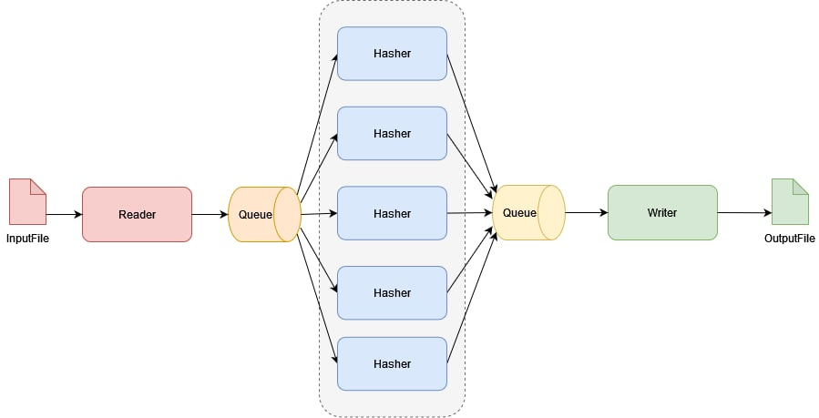

[](https://github.com/kerkerker/signature/actions/workflows/cmake.yml)
[](https://codecov.io/gh/kerkerker/signature)

# signature

## Задание

Требуется написать консольную программу на `C++` для генерации сигнатуры указанного файла.
Сигнатура генерируется следующим образом: исходный файл делится на блоки равной
(фиксированной) длины (если размер файла не кратен размеру блока, последний фрагмент может
быть меньше или дополнен нулями до размера полного блока). Для каждого блока вычисляется
значение `hash` функции и дописывается в выходной файл-сигнатуру.

**Интерфейс**: командная строка, в которой указаны:
- Путь до входного файла
- Путь до выходной файла
- Размер блока (по умолчанию, 1 Мб)

**Обязательные требования**:
- Следует максимально оптимизировать скорость работы утилиты с учетом работы в
многопроцессорной среде
- Код программы должен соответствовать принципам ООП и ООД (читаемость, разбиение
на классы и т.д.).
- Нужно реализовать правильную обработку ошибок на основе эксепшенов
- При работе с ресурсами нужно использовать умные указатели
- Не допускается использовать сторонние библиотеки OpenMP, OpenCL, etc

**Допущения**:
- Размер входного файла может быть много больше размера доступной физической памяти
(> 4 Гб)
- Разрешается использовать boost
- В качестве хэш функции можно использовать любую хэш функцию (MD5, CRC и т.д.)

## Решение





```bash
Options:
  -h [ --help ]                      Display this information.
  -i [ --in_file ] arg               Path to the input file
  -o [ --out_file ] arg              Path to the output file
  -b [ --block_size ] arg (=1000000) Block size for hashing (>0)
```

### Ограничения
- Размер блока должен помещаться в оперативную память (не реализовано хэширование по подблокам с постепенной загрузкой в память)
- Если входной файл пустой, будет посчитан хэш от заполненного нулями блока указанного размера